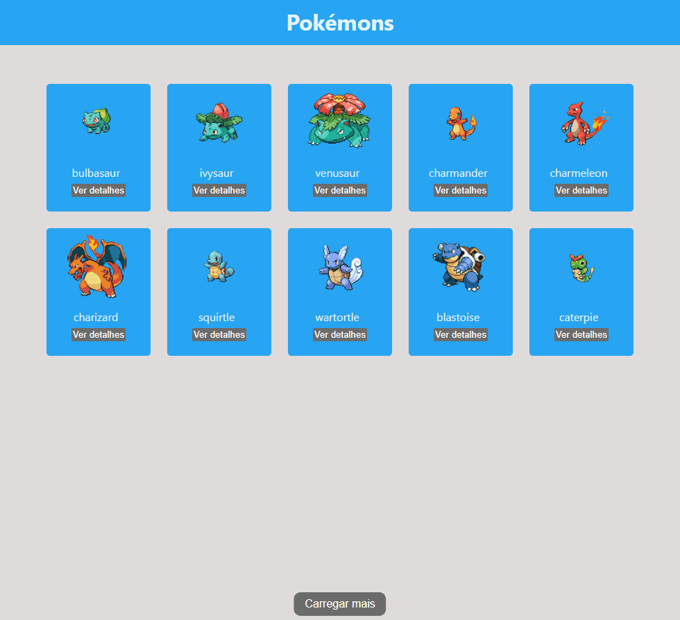

# 🐱‍👤 Projeto Pokédex

## 📌 Descrição do Projeto
Esta aplicação web foi desenvolvida utilizando **React** e tem como objetivo consumir dados de uma **API externa (PokéAPI)** para exibir uma lista de Pokémons de forma dinâmica. Inicialmente são exibidos 10 Pokémons, com a possibilidade de carregar mais itens e visualizar os detalhes individuais de cada Pokémon.

---

## 📽️ Apresentação do projeto

---

## ⚙️ Funcionalidades
- Consulta de dados em uma **API externa (PokéAPI)**
- Exibição inicial de 10 Pokémons
- Botão **“Carregar mais”** para adicionar mais 10 Pokémons à lista
- Navegação para página de **detalhes do Pokémon**
- Exibição de informações como:
  - Nome
  - Imagem
  - Tipo
  - Altura
  - Peso

---

## 🛠️ Ferramentas Utilizadas
- **React**: criação da interface e gerenciamento de estado
- **React Router DOM**: controle de rotas e navegação entre páginas
- **JavaScript (ES6+)**: lógica da aplicação
- **CSS**: estilização da interface
- **PokéAPI**: API utilizada para consulta e obtenção dos dados dos Pokémons

As ferramentas foram escolhidas por facilitarem o desenvolvimento de aplicações modernas, além de permitirem a integração com APIs externas.

---

## 🧠 Decisões de Desenvolvimento
- Utilização de **componentes funcionais** e **Hooks** (`useState` e `useEffect`)
- Implementação de consultas à API utilizando `fetch`
- Paginação baseada em `limit` e `offset`, conforme disponibilizado pela API
- Separação entre página de listagem e página de detalhes para melhor organização do código
- Estrutura simples, priorizando clareza e funcionamento da aplicação

---

## 📄 Observações

Este projeto foi desenvolvido para fins de estudo, com foco em consumo de APIs, React e organização de aplicações front-end.
